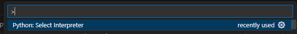

# CONVERSÃO DE AUDIOS
1. seleciona o diretorio com os audios
2. lista todos os audios para serem convertidos
3. converte um a um e salva na pasta de output com o mesmo nome
    - configurações do audio:
        - Bit rate: 64 kbps
        - Audio sample size: 8 bit
        - Channels: 1 (mono)
        - Audio sample rate: 8 kHz
        - Audio format: CCITT μ-Law
        - Formato: .wav

# Criando o Virtual Enviroment
1. É necessário ter instalado python
2. Criando a venv
```python
python -m venv .conversao_audios_wav
```
3. Ativando a venv
```
call .conversao_audios_wav\Scripts\activate
```
4. Instalando as bibliotecas necessárias
```
pip install -r requirementes.txt
```
5. Bibliotecas necessárias
é necessário apenas o **ipykernel**, pois rodará o código no jupyter notebook.
A biblioteca **os** e **subprocess** já são inbuilt do python.
O principal utilizado é o FFMPEG que é instalado a parte.

# Instalando o FFMPEG
Programa necessário para a conversão de audios.

Windows terminal installer:
```
winget install "FFmpeg (Essentials Build)"
```

É necessário colocar o caminho da pasta /bin nas variaveis de ambiente PATH do Windows

Para checar o caminho da pasta bin depois de instalar o FFMPEG basta rodar o código no windows power shell:

```
Get-Command ffmpeg

```

# Executando o código
Após criar a venv com as bibliotecas necessárias siga os passos abaixo:

Abra o main.ipynb:


1. Selecionando o kernel com as bibliotecas necessárias:
2. use o ctrl + shift + p:

3. selecione a venv criada para o projeto

4. Insira o caminho das pastas de input e output:

    - é necessário que as pastas sejam **exatamente** com o nome "input" e "output"
5. Rode o código e espere a conversão:

